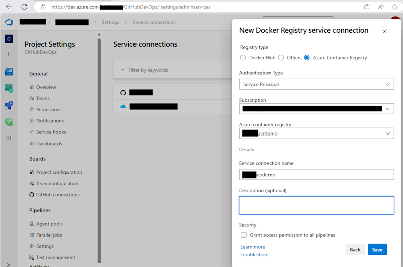

# Azure DevOps Deployment Template Notes

## 1. Setup and Deploy Steps

To deploy this application, execute the following steps:

- [Create an Azure DevOps Service Connection](https://docs.luppes.com/CreateServiceConnections/)

- [Create Azure DevOps Environments](https://docs.luppes.com/CreateDevOpsEnvironments/)

- Create Azure DevOps Variable Groups -- see step 3 for details

- [Create Azure DevOps Pipelines](https://docs.luppes.com/CreateNewPipeline/)

- Run the aca-infra-pipeline.yml pipeline to deploy the base Azure Resources to an Azure subscription.

- Create a Docker Service Connection in the Project Settings

- Add the Docker Service Connection and ACR User/Password to the Variable Group

- Run the aca-deploy-apps-pipeline.yml pipeline to build and deploy the applications to the ACA.

---

## 2. Azure DevOps Template Definitions

These are the main pipelines defined for this project:

- **acr-1-container-registry-pipeline.yml:** Deploys the main-infra.bicep template and creates all of the Azure resources
- **acr-2-deploy-infra-pipeline.yml:** Deploys the main-infra.bicep template and creates all of the Azure resources
- **aca-3-deploy-apps-pipeline.yml:** Builds and deploys all (or some) of the applications to the ACA

These YML files were designed to run as multi-stage environment deploys (i.e. DEV/QA/PROD). Each Azure DevOps environments can have permissions and approvals defined. For example, DEV can be published upon change, and QA/PROD environments can require an approval before any changes are made. If you don't supply environments, it will assume that it is a single environment named 'DEMO'.

---

## 3. Creating the Variable Group "TrafficControlDemo"

### 3.1. Create the Initial Variable Group

Create a variable group with these values before running the aca-infra-pipeline.yml by customizing and running this command in the Azure Cloud Shell:

``` bash
   az login

   az pipelines variable-group create 
     --organization=https://dev.azure.com/<yourAzDOOrg>/ 
     --project='<yourAzDOProject>' 
     --name TrafficControlDemo 
     --variables 
         orgName=xxx-acatc
         subscriptionName=yourAzureServiceConnectionName
         resourceGroupPrefix='rg-dapr-traffic-aca'
         location=eastus
         acrFolderName=dapr-traffic-control
         acrName=TBD
         acrAdminUserName=TBD
         acrAdminPassword=TBD
         azureServiceConnection=yourAzureServiceConnectionName 
         dockerRegistryConnectionName=TBD-(yourDockerServiceConnectionName)
```

### 3.2. Create Docker Service Connection

AFTER creating the Azure Container Registry, go into the Project Settings and create a Docker Service Connection that will allow pipelines to connect to the Container Registry.



### 3.3. Update the Variable Group

After creating the Docker Service Connection, add these four variables in the variable group.  

Find the acrAdminUserName and acrAdminPassword by navigating to the Container Registry in the portal, going to the Access keys tab, and (if the Admin User option is enabled) the password should be visible on that page.

Make these entries in the Variable Group:

``` bash
  dockerRegistryConnectionName=<nameOfTheDockerServiceConnection>
  acrName=<containerRegistryName>
  acrAdminUserName=<fromContainerRegistryPage>
  acrAdminPassword=<fromContainerRegistryPage>
```
